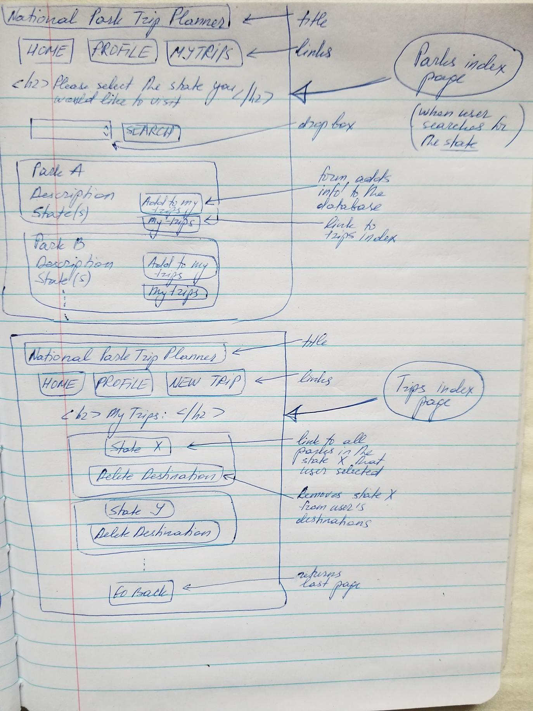

# Project 2
## National Park Trip Planner

For this project, express authentication template using Passport + flash messages + custom middleware was used as a starting point.

## Project Description:

The purpose of this app is to help user plan a trip to the national parks located within the US.  After logging in or signing up, the user may select a state that they would like to visit and search through all the national parks located in that selected state.  

The user may add any (and as many as they desire) parks from the list pulled from the National Parks API.  Additionally, the user may have many trips (note: the trips are categorized by state).  Moreover, the user can view and edit all the potential trips -- they may delete the trip destination and/or delete the parks from a particular trip.

## Used in the Project:
HTML, CSS, JavaScript, Postgress, external API, Heroku.

## Planning Details
### Models:
This project utilizes three models - user, trip, and park. User can have many trips, but the trips belong to one user.  Additionally, there can be many parks in one trip and the same park can belong on different trips. 
 

### Wireframe:

To use the app, the user must either login or sign up, and both options are presented on the main index page.  Moreover, the user can see the app description and some random images of the national parks.

The auth pages for login and signup are of the similar styles - both have forms containing inputs that the user must feel out and submit (by hitting a submit button).  Additionally, there are random images displayed on both auth pages.

There are two profile pages in the app.  When the user first logs in, (in addition to 6 random images of national parks) they see a page with the app description and links to either log out or to proceed to the profile.  Once the user selects the profile, they can click on the links that would take them home, to the parks search page, or to their trips page. 

The parks index page, when the user first navigates to it, displays links to Home, Profile, and Trips.  Additionally, there is a drop menu that the user can click on to select the state they would like to visit.

Once the user selects the state and clicks on the search button, the parks index page displays the list of national parks in the selected state.  Each park has the name, description, and location displayed.  The user has an option to add the park to their trips list by clicking "Add to My Trips" button.  Moreover, user may click on the "My Trips" button to view their trips.

The trips index page lists the states (or trip destinations on which the user can click to view more details) and the options to delet the state from users destinations.

The trips show page displays the list of all the parks the user selected from a particular state.  The user can click on the park to view the park's details or they can delete the park from their destination (or trip).

The parks show page displays the information about the park (obtained from the external API) - weather, campgrounds, and events information.

### Main Index Screenshot:

### Login Page Screenshot:

### Profile Screenshot:

### Parks Index Screenshot:

### Trips Index Screenshot:

### Trips Show Page Screenshot:

### Parks Show Page Screenshot:

## Development Journal:
I have started this project with model definitions and associations between them (please see Planning Details/Models).  The user model has one to many association with the trip model.  In turn, the trip and park model have many to many association between them.  Once the models and the associations were developed, the routes were established.

For the trips, I have created the following routes:
GET /trips - shows ALL the trips that exist;
GET /trips/:id - shows a specific trip;
DELETE /trips/:id - deletes trip destination;

For the parks, I have created the following routes:
GET /parks - displays the list of national parks by state;
POST /parks - adds park to the trip;
GET /parks/:id - renders show page with selected park;
DELETE /parks/:id - deletes park from a trip destination;

For the POST route in parks.js, I have created a hidden form that allows me to save the information I need to make the API calls and also assign the trip to a particular user.

The app allows the user to search through all the parks sorted by state, add the park to the trip(s), delete the park from a trip, and delete the trip.

#### Scaffold w/tests (see `master` branch)

